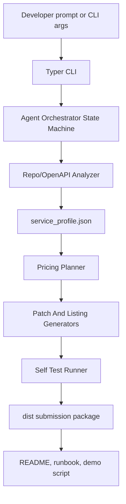
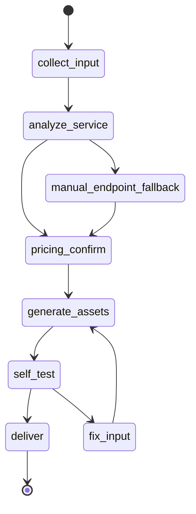

# feat: Build Dragon MCP Pay Agent contest submission

## Summary

构建一个可直接参赛提交的 **Dragon MCP Pay Agent**，目标不是做一个普通 OKR 工具，而是做一个能帮助开发者把现有 API/FastAPI/OpenAPI 服务转成 OKX Marketplace 付费 A2MCP 服务的 Agent。

最终交付物必须能在本仓库本地跑通，并能产出一套完整 `dist/` 参赛包：`payment_patch.diff`、`services.json`、`agent_card.json`、`listing.md`、`test_report.json`、`runbook.md`、`okx_submission_summary.md`。Demo 叙事是“普通 API -> Agent 自动分析和付费化 -> 自测通过 -> 生成可提交 Marketplace 的服务包”。

这条方向比“通用 OKR Agent”更贴合 OKX 奖金目标：它直接服务 OKX Agent Marketplace 的供给增长、付费协议采用和 ASP 开发者 onboarding，而不是只做一个企业效率工具。

---

## Problem Frame

用户目标是提高参赛拿奖概率。纯 OKR Agent 的风险是平台相关性弱，商业闭环不明显，Demo 很容易看起来像通用办公软件。参赛作品应当证明：

- 它理解 OKX Agent Payments Protocol 和 A2MCP/A2A 的核心玩法。
- 它能让更多开发者把已有服务变成可收费、可测试、可上架的 Marketplace 服务。
- 它有完整工程闭环，而不只是概念页或聊天壳。
- 它能在没有真实白名单或真实支付凭证时仍然稳定演示，并在有 OKX 配置时切到真实集成边界。

计划采用“CLI-first + deterministic tools + Agent orchestration”的结构。Agent 负责引导、解释、确认和串联步骤；实际解析、生成、校验、自测都由可测试工具完成。

---

## Requirements

### Contest Package

- R1. 仓库包含一个可运行、可演示、可评审的 Dragon MCP Pay Agent，不依赖外部私有状态才能展示核心价值。
- R2. 一次完整工作流必须生成 `dist/payment_patch.diff`、`dist/services.json`、`dist/agent_card.json`、`dist/listing.md`、`dist/test_report.json`、`dist/runbook.md`、`dist/okx_submission_summary.md`。
- R3. `README.md`、`docs/demo-script.md`、`docs/submission-checklist.md` 必须支持评委在短时间内理解价值、运行路径、Demo 口径和提交材料。

### Onboarding Workflow

- R4. CLI 支持输入本地服务路径、OpenAPI JSON URL/文件、手动 endpoint 描述、服务名称、价格、币种、输出目录。
- R5. Agent workflow 必须记录阶段状态：收集输入、服务分析、价格确认、资产生成、自测、交付。
- R6. 价格、付费 endpoint、输出目录、是否启用真实 OKX 模式必须有确认门，避免生成错误商业配置。

### Service Analysis And Artifact Generation

- R7. FastAPI/OpenAPI 解析器必须产出 `service_profile.json`，包含服务名、endpoint、HTTP method、参数、响应样例、鉴权假设、风险提示。
- R8. Pricing planner 必须产出 `pricing_plan.json`，默认支持一次性 exact payment，并给出定价解释和可修改字段。
- R9. FastAPI payment generator 必须产出 mock payment 路径和 OKX real adapter 边界；mock 路径用于稳定评审，real adapter 由环境变量和官方 SDK 配置启用。
- R10. Listing generator 必须验证并写出 `services.json`、`listing.md`、`agent_card.json`，内容明确表达 A2MCP provider 和 ASP onboarding 价值。

### Verification And Demo

- R11. Self-test runner 必须验证未付费请求被拒绝、mock paid 请求成功、业务参数错误被报告。
- R12. `examples/price_api` 必须能作为普通 API 独立运行，也能作为 Dragon MCP Pay Agent 的演示输入。
- R13. Demo 脚本必须控制在 90-120 秒，展示“普通 API -> Agent 任务 -> 生成包 -> 自测证据 -> OKX Marketplace 叙事”。

### Safety And Scope

- R14. 真实 OKX SDK 路径必须是 opt-in；默认测试不得要求真实钱包、真实 API key、真实链上支付或白名单。
- R15. 仓库不得提交 secrets；所有真实支付配置通过 `.env.example` 和运行时环境变量说明。
- R16. 本次参赛交付只自动支持 FastAPI/OpenAPI；其他框架通过 manual endpoint mode 和文档化 follow-up 覆盖，不进入自动 patch 范围。

---

## High-Level Technical Design



核心状态机：



Agent 层不直接“自由写代码”。它调用结构化工具，工具输入输出都用 Pydantic v2 schema 校验。这样 Demo 稳定、测试可覆盖、生成物可复现。

---

## Output Structure

```text
.
├── pyproject.toml
├── README.md
├── apps/
│   ├── agent/
│   │   ├── graph.py
│   │   ├── prompts.py
│   │   └── state.py
│   └── cli/
│       └── onboard.py
├── tools/
│   ├── models.py
│   ├── repo_scanner.py
│   ├── openapi_parser.py
│   ├── pricing_planner.py
│   ├── patch_generator.py
│   ├── listing_generator.py
│   ├── self_test_runner.py
│   └── report_generator.py
├── templates/
│   ├── fastapi/
│   │   ├── payment_adapter.py.j2
│   │   ├── payment_middleware.py.j2
│   │   ├── env.example.j2
│   │   └── test_payment.py.j2
│   └── listing/
│       ├── services.json.j2
│       ├── listing.md.j2
│       └── agent_card.json.j2
├── examples/
│   └── price_api/
│       ├── main.py
│       └── requirements.txt
├── tests/
│   ├── test_models.py
│   ├── test_example_price_api.py
│   ├── test_openapi_parser.py
│   ├── test_pricing_planner.py
│   ├── test_patch_generator.py
│   ├── test_listing_generator.py
│   ├── test_self_test_runner.py
│   ├── test_report_generator.py
│   ├── test_cli_onboard.py
│   └── test_submission_package.py
├── docs/
│   ├── demo-script.md
│   ├── submission-checklist.md
│   └── submission-summary.md
└── dist/
```

`dist/` 是生成目录。仓库可以保留一份 sample dist 作为评审参考，但真实工作流必须能重新生成它。

---

## Key Technical Decisions

- KTD1. **CLI-first，不先做 Web UI。** 参赛评审更需要可复现的端到端证据；CLI 更容易测试、录屏和打包。Typer 提供 prompt、confirm 和 `CliRunner` 测试能力。
- KTD2. **Agent orchestrator + deterministic tools。** Agent 负责对话和决策解释，解析、生成、校验、自测由工具完成，降低幻觉和 Demo 失败概率。
- KTD3. **FastAPI/OpenAPI 是唯一自动 patch 框架。** OKX seller SDK 官方示例覆盖 FastAPI，OpenAPI 又天然可抽取 endpoint 合约；Node/Express 放入后续增强，不进入本次参赛主线。
- KTD4. **PaymentAdapter 拆成 mock 和 real。** `MockPaymentAdapter` 保证无白名单也能演示 402/paid success 流程；`OkxPaymentAdapter` 保留官方 SDK 集成边界，靠环境变量启用。
- KTD5. **Pydantic v2 schema 是生成物真源。** `service_profile.json`、`pricing_plan.json`、`services.json`、`agent_card.json`、`test_report.json` 都先校验再写出。
- KTD6. **Self-test report 是一等交付物。** 评委不只看到生成代码，还看到 unpaid rejection、mock paid success、业务错误路径的机器可读证据。
- KTD7. **参赛叙事聚焦 OKX 生态供给增长。** 页面、README、listing 和 summary 都强调“帮 ASP 更快上架付费服务”，不把作品包装成通用 OKR 工具。

---

## Implementation Units

### U1. Project Scaffold And Artifact Schemas

Files:

- `pyproject.toml`
- `README.md`
- `tools/models.py`
- `tests/test_models.py`
- `docs/submission-checklist.md`

Requirements: R1, R2, R3, R14, R15

Work:

- 建立 Python 项目、基础依赖、测试配置和包结构。
- 定义核心 Pydantic models：`ServiceProfile`、`PricingPlan`、`GeneratedArtifactManifest`、`AgentCard`、`SelfTestReport`。
- 明确所有 generated artifact 的字段、默认值和校验规则。

Tests:

- 必填字段缺失时校验失败。
- JSON 输出为稳定、可提交格式。
- manifest 能枚举所有 `dist/` 必需文件。
- schema 不包含真实 secret 字段值，只包含 env var 名称或占位说明。

### U2. Example FastAPI Price Service

Files:

- `examples/price_api/main.py`
- `examples/price_api/requirements.txt`
- `tests/test_example_price_api.py`

Requirements: R7, R11, R12, R13

Work:

- 实现最小但完整的普通价格查询 API，例如 `GET /price?symbol=BTC-USDT`。
- 暴露 FastAPI 自动生成的 OpenAPI contract。
- 返回稳定样例数据，方便录屏和断言。

Tests:

- `/openapi.json` 可获取并包含 `/price`。
- `/price` happy path 返回 symbol、price、source。
- 缺少或非法 symbol 时返回可解释错误。
- 响应样例可被 parser 捕获。

### U3. Repo/OpenAPI Analysis And Manual Fallback

Files:

- `tools/repo_scanner.py`
- `tools/openapi_parser.py`
- `tests/test_openapi_parser.py`

Requirements: R4, R7, R16

Work:

- 支持本地 OpenAPI JSON 文件和 URL 输入。
- 支持从 FastAPI 项目中发现 OpenAPI endpoint 或应用入口。
- 产出 `service_profile.json`。
- 当 parser 无法确认 endpoint 时，进入 manual endpoint mode，而不是直接失败。

Tests:

- 能解析示例服务的 OpenAPI JSON。
- 能识别 method、path、query params、response schema。
- manual endpoint 输入能生成有效 `service_profile.json`。
- unsupported framework 输出可操作错误和 fallback 指引。

### U4. Pricing Planner And Confirmation State

Files:

- `tools/pricing_planner.py`
- `apps/agent/state.py`
- `tests/test_pricing_planner.py`

Requirements: R5, R6, R8, R14

Work:

- 根据 endpoint 类型、调用成本、Demo 口径生成默认价格建议。
- 默认参赛 Demo 使用 `0.01 USDT` 作为 listing 价格展示；真实 OKX SDK route config 中的资产配置必须与官方支持资产分离，允许使用 `USD₮0` 等官方文档支持的配置。
- 价格、币种、付费模式、目标 endpoint 进入确认状态后才能继续生成。

Tests:

- 默认定价包含金额、币种、付费模式、理由。
- 用户覆盖 price/currency 后能稳定写入 `pricing_plan.json`。
- 未确认 pricing 时 workflow 不进入 generation。
- mock mode 和 real mode 的配置边界清晰。

### U5. FastAPI Payment Patch Generator

Files:

- `tools/patch_generator.py`
- `templates/fastapi/payment_adapter.py.j2`
- `templates/fastapi/payment_middleware.py.j2`
- `templates/fastapi/env.example.j2`
- `templates/fastapi/test_payment.py.j2`
- `tests/test_patch_generator.py`

Requirements: R2, R9, R11, R14, R15, R16

Work:

- 基于 `service_profile.json` 和 `pricing_plan.json` 生成 `payment_patch.diff`。
- 生成 mock payment adapter：未带 mock paid header 时返回 payment required；带 mock paid header 时允许通过。
- 生成 real adapter 边界：说明 OKX seller SDK、broker、recipient wallet、developer API key、route config 的环境变量占位。
- 生成示例 payment test 文件，作为被集成服务的参考。

Tests:

- diff 中包含目标 endpoint 的付费保护说明。
- mock adapter 能覆盖 unpaid 和 paid 两条路径。
- real adapter 代码不硬编码 secret。
- 非 FastAPI profile 不进入自动 patch，返回 manual instructions。

### U6. Listing And Agent Card Generator

Files:

- `tools/listing_generator.py`
- `templates/listing/services.json.j2`
- `templates/listing/listing.md.j2`
- `templates/listing/agent_card.json.j2`
- `tests/test_listing_generator.py`

Requirements: R2, R3, R10, R13

Work:

- 生成 Marketplace-facing listing copy，突出可付费 endpoint、调用方式、价格、测试证据和 ASP onboarding 价值。
- 生成 `services.json`，描述服务 endpoint、price、payment mode、capabilities。
- 生成 `agent_card.json`，描述 Dragon MCP Pay Agent 的任务能力、输入输出和适用场景。

Tests:

- `services.json` 是合法 JSON 并包含 service id、endpoint、price、payment fields。
- `agent_card.json` 是合法 JSON 并包含 agent name、description、capabilities、artifact outputs。
- `listing.md` 包含 OKX Marketplace、A2MCP provider、paid API conversion、self-test evidence 等关键词。
- generator 对缺失字段给出明确错误。

### U7. Self-Test Runner And Report Generator

Files:

- `tools/self_test_runner.py`
- `tools/report_generator.py`
- `tests/test_self_test_runner.py`
- `tests/test_report_generator.py`

Requirements: R2, R11, R12, R14

Work:

- 对示例服务或生成后的 mock payment wrapper 执行本地请求测试。
- 记录 unpaid rejection、mock paid success、invalid business input 三类结果。
- 生成 `test_report.json` 和 human-readable report 摘要。

Tests:

- unpaid request 记录 expected rejection。
- mock paid request 记录 success payload。
- invalid params 记录业务错误路径。
- report 包含时间戳、环境模式、artifact 列表、总体 pass/fail。

### U8. Typer CLI And Orchestrated Workflow

Files:

- `apps/cli/onboard.py`
- `apps/agent/graph.py`
- `apps/agent/prompts.py`
- `tests/test_cli_onboard.py`

Requirements: R4, R5, R6, R8, R13

Work:

- 实现 `onboard` workflow：收集输入、解析服务、建议定价、确认、生成资产、自测、输出交付路径。
- 支持全参数 non-interactive 模式，方便 CI 和录屏。
- 支持交互 prompt 模式，体现 Agent 服务体验。
- workflow 状态可序列化，失败时能报告停在哪一步和如何恢复。

Tests:

- 全参数模式能一键生成完整 `dist/`。
- 缺参数时 prompt 能收集服务名、价格、币种、输出目录。
- 用户拒绝 pricing confirm 时不生成付费 patch。
- parser fallback 后仍能继续 manual endpoint flow。

### U9. Contest Documentation And Submission Package

Files:

- `README.md`
- `docs/demo-script.md`
- `docs/submission-checklist.md`
- `docs/submission-summary.md`
- `tests/test_submission_package.py`

Requirements: R1, R2, R3, R13

Work:

- README 首屏说明项目价值、OKX 相关性、快速运行路径、输出物说明。
- Demo script 按 90-120 秒组织：痛点、普通 API、Agent onboarding、生成包、自测报告、Marketplace 价值。
- Submission summary 直接服务参赛材料，包含项目名、一句话介绍、技术亮点、商业价值、评审要点。
- Checklist 覆盖录屏、截图、生成物、README、测试报告、真实 OKX 配置说明。

Tests:

- `dist/` 包含全部必需文件。
- README 引用了 demo service、CLI、generated artifacts、mock/real payment boundary。
- Demo script 包含完整故事线且不依赖真实支付成功。
- Submission summary 明确说明 OKX Agent Marketplace 和 Agent Payments Protocol 价值。

### U10. Real OKX SDK Boundary Documentation And Smoke Checks

Files:

- `templates/fastapi/payment_adapter.py.j2`
- `templates/fastapi/env.example.j2`
- `docs/okx-real-mode.md`
- `tests/test_okx_real_mode_config.py`

Requirements: R9, R14, R15

Work:

- 文档化真实 OKX mode 的配置项：recipient wallet、developer API key、broker/base URL、network、asset、route config。
- 在模板中保留官方 SDK import 和 middleware 适配点，但默认不执行真实支付。
- 将真实支付失败、未配置、未白名单的场景转成可解释提示。

Tests:

- 缺少 env 时 real mode 不会被误启用。
- `.env.example` 只包含变量名和占位符。
- route config 字段结构与官方 seller SDK 文档保持一致。
- 默认测试套件不发起外部链上或 OKX 网络请求。

---

## Dependencies And Sequencing

1. U1 先完成，因为 schema、manifest、项目结构会约束后续所有生成物。
2. U2 和 U3 串行推进，先有稳定示例 API，再验证 parser 能从它抽取 profile。
3. U4 依赖 U3 的 `service_profile.json`，输出 `pricing_plan.json`。
4. U5 和 U6 都依赖 U3/U4，可以并行实现，但都必须使用 U1 schema。
5. U7 依赖 U5 的 mock payment output 和 U2 示例服务。
6. U8 串联 U3-U7，是端到端工作流入口。
7. U9 在 U8 跑通后收口，确保文档讲的是实际能跑的系统。
8. U10 贯穿 U5/U9，但不能阻塞 mock demo path。

---

## Scope Boundaries

In scope:

- 可运行的 Python/Typer CLI Agent。
- FastAPI/OpenAPI 自动分析和自动生成付费化补丁。
- 示例普通 API 服务。
- Mock payment + OKX real adapter boundary。
- `dist/` 参赛包生成。
- 自测报告、README、Demo 脚本、提交摘要。

Deferred:

- Node/Express 自动 patch。
- 远程 GitHub 仓库深度扫描。
- Web UI。
- 多 endpoint 批量定价。
- batch payment、pay-as-you-go、escrow 的完整实现。
- 自动提交 OKX Marketplace。

Explicitly out of scope:

- 通用企业 OKR 管理系统。
- 交易机器人。
- 生产级风控、合规、计费账务系统。
- 保证真实 OKX 白名单或真实 Marketplace 审核通过。

---

## System-Wide Impact

- Public interface: `apps/cli/onboard.py` 提供主要用户入口；后续如果接入聊天 Agent，也应复用同一 orchestrator 和 tools。
- Generated contracts: `service_profile.json`、`pricing_plan.json`、`services.json`、`agent_card.json`、`test_report.json` 是外部评审和后续扩展的稳定接口。
- Security: 所有真实凭证必须通过环境变量；生成物不得写入真实 secret。
- Testing: 默认测试必须纯本地、可重复、无真实支付副作用。
- Documentation: README 和 submission docs 是参赛体验的一部分，不能作为最后临时补丁处理。

---

## Risks And Mitigations

- Risk: OKX Payment SDK 或官方字段在比赛期间变化。
  Mitigation: 真实 OKX mode 只作为 adapter boundary，mock path 保证核心 Demo；文档列出官方资料日期和可替换配置点。

- Risk: 没有 OKX 白名单或真实支付环境，导致 Demo 无法支付成功。
  Mitigation: 默认用 mock adapter 证明 HTTP 402/paid success 行为；real mode 文档说明需要的前置条件。

- Risk: OpenAPI 自动识别失败。
  Mitigation: manual endpoint mode 是正式路径，不是异常兜底；评审时也可用手动输入跑完整流程。

- Risk: 作品被认为只是开发者工具，不像 Agent。
  Mitigation: CLI prompt、orchestrator state、pricing confirmation、artifact explanation 和 submission summary 都强调 Agent 任务链，而不是单个脚本。

- Risk: 生成代码破坏目标服务。
  Mitigation: 默认生成 diff 和独立模板，不直接覆写用户项目；示例服务用于全自动验证。

- Risk: 参赛包过于技术化，评委无法快速理解。
  Mitigation: Demo script、listing、summary 都用“帮助 OKX 增加可付费 Marketplace 服务供给”的商业叙事收口。

---

## Acceptance Examples

- AE1. 使用 `examples/price_api` 作为输入，指定服务名、价格、币种和输出目录后，工作流生成完整 `dist/` 包，manifest 中所有文件存在。
- AE2. `service_profile.json` 能描述 `/price` endpoint、`symbol` 参数、响应样例和 FastAPI/OpenAPI 来源。
- AE3. `pricing_plan.json` 包含 amount、currency、payment mode、付费 endpoint、定价理由和确认状态。
- AE4. 未付费请求在 self-test 中被记录为 expected rejection。
- AE5. mock paid 请求在 self-test 中返回业务 success payload。
- AE6. 缺少或非法业务参数时，self-test 报告记录业务错误，而不是误判为支付失败。
- AE7. 没有任何 OKX env 时，默认工作流仍然成功；开启 real mode 但缺配置时，返回可解释错误。
- AE8. `listing.md` 和 `okx_submission_summary.md` 明确说明项目如何帮助 ASP 把普通 API 变成 OKX Marketplace paid service。
- AE9. README 和 demo script 足够支撑 90-120 秒录屏，不要求评委阅读源码才能理解价值。

---

## Documentation And Operational Notes

- `README.md` 首屏要直接写清楚：Dragon MCP Pay Agent converts ordinary APIs into paid OKX Marketplace-ready A2MCP services.
- `docs/demo-script.md` 要按镜头组织，不写成长文说明。
- `docs/submission-checklist.md` 要覆盖生成物、测试报告、录屏、截图、真实 OKX 配置说明和最终提交摘要。
- `docs/okx-real-mode.md` 要明确 mock mode 与 real mode 的差异，避免评委误以为 mock 是伪造真实链上付款。
- `dist/runbook.md` 要服务评委复现，而不是只服务开发者调试。

---

## Sources And Research

- Supplied OKX Agent Marketplace contest development document.
- OKX Agent Payments Protocol documentation: `https://web3.okx.com/onchainos/dev-docs/payments/app`
- OKX Agent Payments overview: `https://web3.okx.com/onchainos/dev-docs/payments/overview`
- OKX Seller SDK integration documentation: `https://web3.okx.com/onchainos/dev-docs/payments/service-seller-sdk`
- OKX prompt-based seller integration documentation: `https://web3.okx.com/onchainos/dev-docs/payments/service-seller-prompt`
- OKX Run Your First MCP documentation: `https://web3.okx.com/onchainos/dev-docs/home/run-your-first-mcp`
- OKX payments SDK repository: `https://github.com/okx/payments`
- FastAPI documentation checked through Context7: OpenAPI generation and `TestClient` behavior.
- Pydantic v2 documentation checked through Context7: model validation and JSON serialization.
- Typer documentation checked through Context7: prompt/confirm options and `CliRunner` tests.
